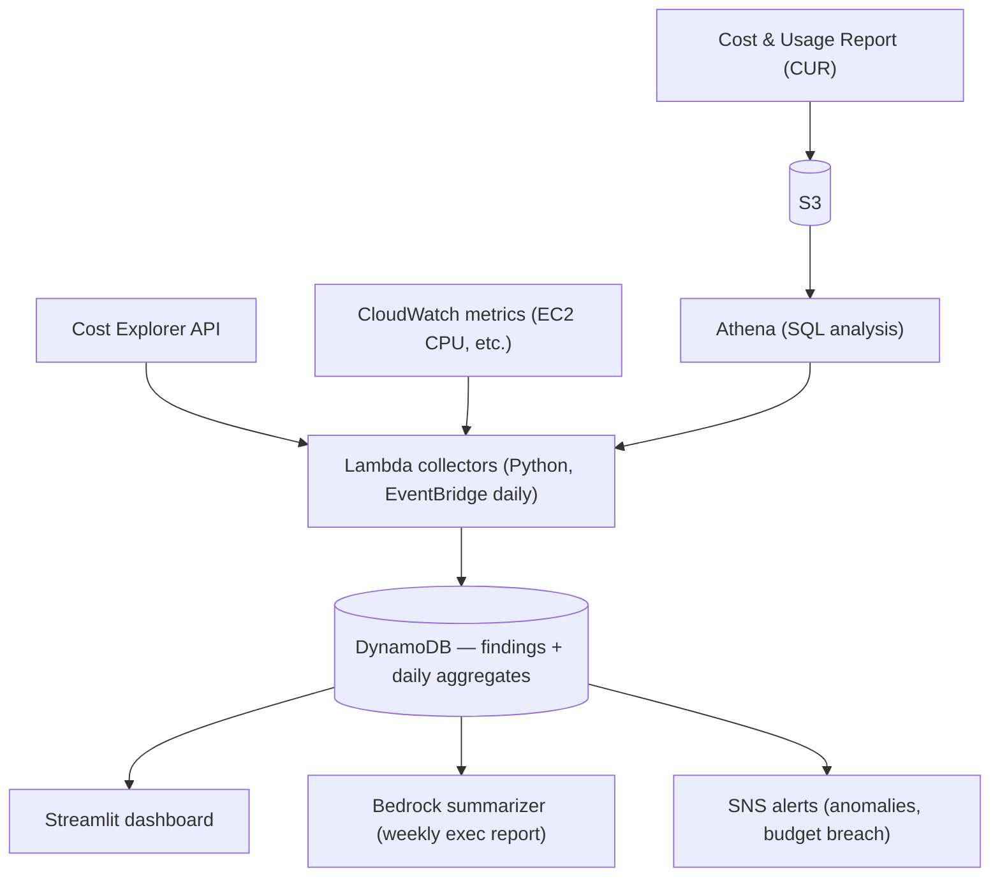

# FinOps Cost Optimization Dashboard

[](https://github.com/Rjnoord/finops-dashboard/actions/workflows/ci.yml)
[](https://github.com/Rjnoord/finops-dashboard/actions/workflows/deploy.yml)

A FinOps analytics platform on AWS that gives a finance/engineering team three capabilities around cloud spend: **visibility** (where money goes, by team and service), **accountability** (tag-compliance enforcement), and **action** (ranked savings opportunities with AI-generated remediation plans). Everything is provisioned by Terraform and deployed through a zero-stored-credentials GitOps pipeline.

## The Business Problem

A mid-size company's AWS bill grows 8–12% monthly with no clear owner. Finance can't allocate costs because tagging is inconsistent; engineering leaves idle resources running; nobody notices anomalies until the invoice arrives. This platform closes that loop.

### KPIs the dashboard reports
- Monthly spend trend + forecast vs. budget
- Tag compliance % (resources with required `Owner`, `Environment`, `CostCenter` tags)
- Identified monthly savings ($ from idle/oversized/orphaned resources)
- Anomalies detected and time-to-detection

## Architecture



Supporting services: AWS Budgets, Cost Anomaly Detection, per-Lambda least-privilege IAM, KMS encryption for DynamoDB/S3. **Everything provisioned by Terraform.**

## CI/CD Pipeline — Zero Stored Credentials

No AWS access keys exist anywhere in this repo or in GitHub secrets. GitHub Actions authenticates to AWS via **OIDC federation**:

1. GitHub mints a short-lived signed JWT per workflow run.
2. AWS STS verifies it against an IAM OIDC provider and a trust policy scoped to this exact repo.
3. STS issues temporary credentials for one of two roles:

| Role | Assumable from | Permissions |
|---|---|---|
| `finops-github-plan` | Pull requests | `ReadOnlyAccess` + Terraform state read/write + lock |
| `finops-github-deploy` | `main` branch only (exact `StringEquals` on the OIDC `sub` claim) | `PowerUserAccess` + IAM scoped to `finops-*` roles/policies only |

The deploy role deliberately **cannot create arbitrary IAM roles** — PowerUserAccess denies IAM, and the scoped grant only covers resources named `finops-*`. A compromised pipeline can't escalate to admin.

### Workflows

| Workflow | Trigger | What it does |
|---|---|---|
| `ci.yml` | Every PR + push to main | `terraform fmt` / `validate` / `tflint` / `checkov` policy scan; `ruff` / `black` / `pytest` once Python collectors land |
| `plan.yml` | Pull requests | Assumes the plan role, runs `terraform plan` for review |
| `deploy.yml` | Merge to main | Assumes the deploy role, runs `terraform apply` |

This is the standard IaC promotion flow: **plan on PR, apply on merge**.

## Repo Structure

```
finops-dashboard/
├── .github/workflows/        # ci.yml, plan.yml, deploy.yml
├── terraform/
│   ├── bootstrap/            # one-time: S3 state bucket + DynamoDB lock table
│   ├── modules/
│   │   ├── oidc_github/      # OIDC provider + plan/deploy roles
│   │   └── billing_alarm/    # $10 spend guardrail → SNS email
│   └── envs/dev/             # composition root (backend.tf, main.tf)
├── src/                      # Lambda collectors (Phase 4)
├── dashboard/                # Streamlit app (Phase 6)
├── tests/                    # pytest + moto (Phase 4)
└── docs/                     # architecture diagram + decision log (Phase 7)
```

## Security & Cost Guardrails

- **Billing alarm at $10** — SNS email fires if estimated lab charges cross the threshold
- **State bucket**: versioned, KMS-encrypted, public-access blocked, lifecycle rule expires noncurrent state versions after 90 days
- **Lock table**: DynamoDB with point-in-time recovery, on-demand billing
- **Checkov** policy scanning gates every PR; deviations are explicit inline skips with written justifications (single-account lab context)
- `terraform destroy` after each documented run keeps lab costs near zero

## Build Phases

| Phase | Scope | Status |
|---|---|---|
| 1 | Remote state backend, GitHub OIDC roles, billing alarm | ✅ |
| 2 | CI pipeline: lint/scan/test on PR, plan-on-PR, apply-on-merge | ✅ |
| 3 | CUR → S3 → Athena with saved cost-analysis queries | ✅ |
| 4 | Lambda collectors: idle EC2, orphaned storage, tag compliance, cost aggregates | ✅ |
| 5 | Budgets + Cost Anomaly Detection + Bedrock weekly exec summary | ✅ |
| 6 | Streamlit dashboard | ✅ |
| 7 | Wasteful-resource simulation, findings writeup, decision log | ✅ |

## Results — the simulation (2026-07-03)

`terraform/scenarios/wasteful` seeded deliberately untagged waste (an unattached
EBS volume and an idle Elastic IP, local state, destroyed after the run). The
platform, unprompted, produced:

| Capability | Result |
|---|---|
| **Action** | `orphaned_storage` priced **$8.00/month across 3 resources** — both seeded resources plus a pre-existing idle Elastic IP nobody knew about |
| **Accountability** | Tag compliance **0% → 50.6%** (81 resources) after one enforcement change: adding `CostCenter` to the provider's `default_tags` and re-applying |
| **Visibility** | Cost Anomaly Detection surfaced **2 real anomalies**; daily spend by service cached in DynamoDB for the dashboard |
| **Reporting** | The Bedrock summarizer turned 4 findings + 3 cost rows into an executive summary and delivered it via SNS email, end to end |

Architecture detail and the five key design decisions (CUR vs Cost Explorer,
OIDC vs stored keys, DynamoDB vs RDS, Streamlit, plan/apply split):
[docs/architecture.md](docs/architecture.md).

## Setup (reproduce from scratch)

1. **Bootstrap state backend** (one time, local state):
   ```bash
   cd terraform/bootstrap && terraform init && terraform apply
   ```
2. **Enable billing alerts** (console, one time): Billing → Billing Preferences → "Receive CloudWatch Billing Alerts"
3. **Deploy dev**:
   ```bash
   cd terraform/envs/dev
   cp terraform.tfvars.example terraform.tfvars   # set your alert email
   terraform init && terraform apply
   ```
   Confirm the SNS subscription email AWS sends you.
4. **Wire GitHub to AWS**: copy the two output ARNs into repo **Settings → Secrets and variables → Actions**:
   - Variables: `AWS_PLAN_ROLE_ARN`, `AWS_DEPLOY_ROLE_ARN`
   - Secret: `ALERT_EMAIL`
