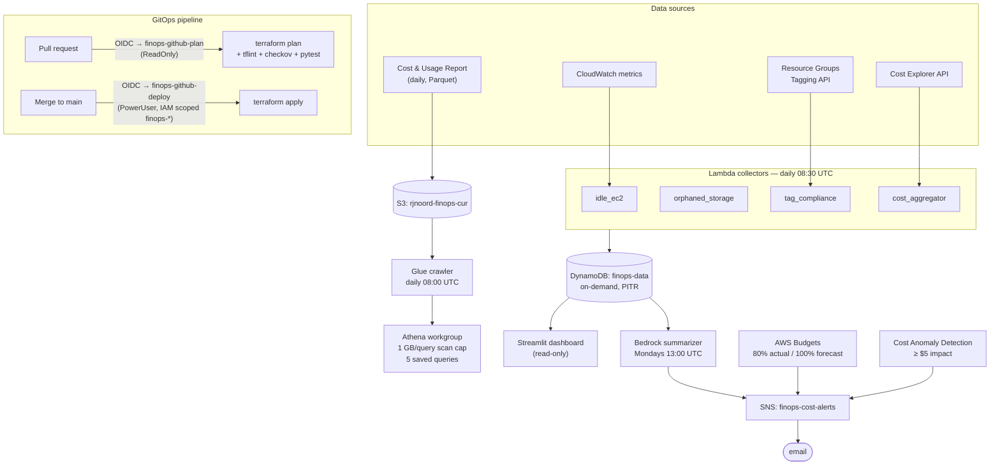

# Architecture & Decision Log

## System diagram

## Decision log

### 1. CUR + Athena over Cost Explorer alone
Cost Explorer answers "what did I spend by service," but it costs $0.01 per API
request, caps out at pre-aggregated dimensions, and can't answer resource-level
questions like "which untagged resources cost the most last week." The Cost &
Usage Report is the raw line-item ledger — free to deliver, queryable with plain
SQL through Athena, and the industry-standard base for FinOps tooling. We keep a
small CE call (one/day, cached in DynamoDB) for the dashboard's trend data so
the UI never pays per-request prices, and use CUR/Athena for the deep analysis.
The Athena workgroup enforces a 1 GB per-query scan cap, so a runaway query
costs at most about half a cent.

### 2. GitHub OIDC federation over stored access keys
No AWS credential exists in GitHub. Each workflow run gets a short-lived, signed
JWT from GitHub; AWS STS verifies it against a trust policy pinned to this exact
repo. Two roles enforce promotion: `finops-github-plan` (assumable from PRs,
ReadOnlyAccess) and `finops-github-deploy` (assumable only from `main` via exact
`StringEquals` on the `sub` claim). The deploy role gets PowerUserAccess — which
denies all IAM — plus a scoped grant limited to `finops-*` roles/policies, so a
compromised pipeline cannot mint itself an admin role. Nothing to rotate,
nothing to leak. Proven in practice: the plan role's ReadOnlyAccess turned out
not to cover `cur:DescribeReportDefinitions`, and the failure mode was a denied
API call in CI — not a leaked key.

### 3. DynamoDB over RDS for findings storage
The access patterns are exactly two: "findings of type X, newest first" and
"costs for day Y, by service." A single DynamoDB table with composite keys
(`FINDING#<type>` / `<date>#<resource>`, `COST#<date>` / `SERVICE#<service>`)
serves both as key lookups. On-demand billing means the table costs
approximately nothing between daily collector runs — an RDS instance would
idle at ~$15+/month, need VPC plumbing for every Lambda, and bring migration
overhead for a schema with two access patterns. PITR is enabled because it's
nearly free at this scale.

### 4. Streamlit over a custom React/API stack
The dashboard's job is internal visibility, not a product surface. Streamlit
turns the DynamoDB queries into a working dashboard in one Python file that the
same engineers who own the collectors can maintain — no separate frontend
toolchain, no API layer to secure, read-only AWS calls straight from the app.
The trade-off (less UI control, session-based rendering) is the right one until
someone outside the team needs access; then App Runner + Cognito is the upgrade
path.

### 5. Plan-on-PR / apply-on-merge split
Every PR gets `terraform plan` output produced by a read-only role, plus fmt,
tflint, checkov, and pytest gates — reviewers see exactly what will change
before merge, and the credentials that produce the preview physically cannot
apply it. Only a merge to protected `main` can assume the deploy role. This
caught real issues before they reached the account: policy findings from
checkov, a Lambda concurrency quota violation, and IAM gaps surfaced as failed
plans on the PR instead of broken applies on main.

## Operational notes

- **Lab guardrails:** $10 billing alarm (us-east-1), monthly budget with 80%/100%
  notifications, anomaly alerts at ≥ $5 impact.
- **Account quirk worth knowing:** new accounts get a Lambda concurrency quota
  of 10 — the AWS minimum unreserved pool — which makes *any* per-function
  reserved concurrency impossible. AWS also auto-creates the one allowed
  SERVICE-dimension anomaly monitor; we imported it into Terraform state rather
  than fighting the quota.
- **Simulation:** `terraform/scenarios/wasteful` seeds untagged waste (EBS
  volume, Elastic IP, optional idle instance) with local state; apply, let the
  collectors run, screenshot, destroy.
